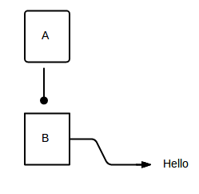

# skyrta

A Node.js wrapper around popular graphing tools to generate graphs.


[](https://badge.fury.io/js/skyrta) [](https://travis-ci.org/rhanekom/skyrta) [](https://codeclimate.com/github/rhanekom/skyrta/maintainability) 

A wrapper around some popular graph tools to generate diagrams from their text representation.

This package currently supports:

-   [SvgBobRus][bobrus] for ASCII diagrams
-   [GraphViz][graphviz] for diagrams expressed in dot

This package is simple in that it  passes in the input provided directly over stdin to the appropriate process and returns the generated SVG.  


## Usage

```bash
npm install skyrta --save
```

And then:

```javascript
const skyrta = require('skyrta');
let svg = skyrta.generate('bob', '----->');
```

To get the raw string data you can either call `toString()` on the object or use the `value` property:

```javascript
let svg = skyrta.generate('bob', '----->').toString();
```

or

```javascript
let svg = skyrta.generate('bob', '----->').value;
```

Some diagramming tools like GraphViz outputs full SVG, including `DOCTYPE` and XML tags.  To strip these for embedding purposes in HTML you can use the `toEmbed` function which will strip out anything outside of the `<svg>` tag.

```javascript
let svg = skyrta.generate('bob', '----->').toEmbed();
```

### Diagrams

#### SvgBobRus diagrams

This package expects svgbob_cli to available in the system path.  Installation:

`cargo install svgbob_cli`

You can find specific instructions on the [repo page][bobrus].

```javascript
let svg = skyrta.generate('bob', '*----->').toEmbed();
```

An input like this


will provide the following (rendered) SVG diagram:



#### Graphviz

Graphviz can be installed in most cases via your package manager.  See the [download page][graphviz-download] for manual downloads and installation instruction instructions.

A simple graph


will provide the following (rendered) SVG diagram:


## Demo

`Skyrta` is used in the `gatsby-remark-draw` plugin to convert code blocks in Markdown to inline SVG.  You can see some samples in action [here](https://rhanekom.github.io/gatsby-remark-draw-demo/).


[bobrus]: https://github.com/ivanceras/svgbobrus

[graphviz]: https://www.graphviz.org/

[graphviz-download]: https://www.graphviz.org/download/
