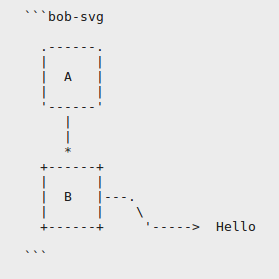
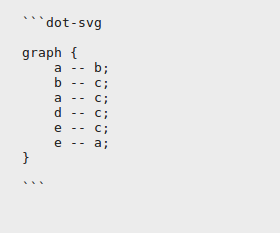
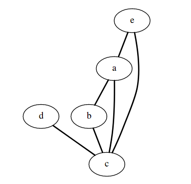
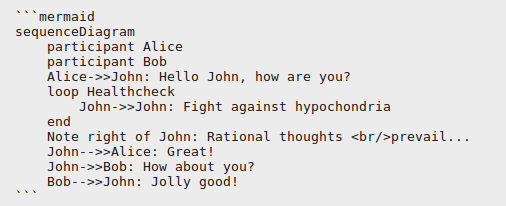
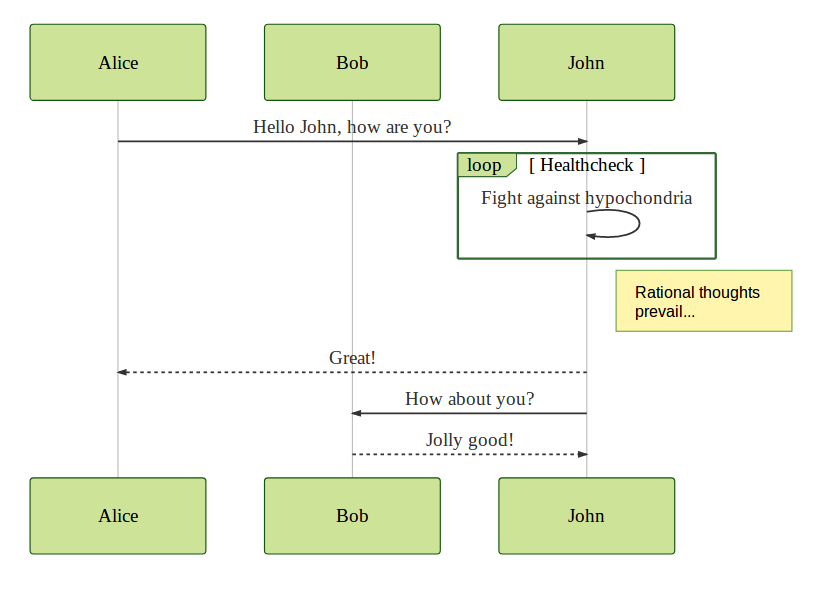

# skyrta

A Node.js wrapper around popular graphing tools to generate graphs.


[](https://badge.fury.io/js/skyrta) [](https://travis-ci.org/rhanekom/skyrta) [](https://codeclimate.com/github/rhanekom/skyrta/maintainability) 

A wrapper around some popular graph tools to generate diagrams from their text representation.

This package currently supports:

-   [SvgBobRus][bobrus] for ASCII diagrams
-   [GraphViz][graphviz] for diagrams expressed in dot
-   [Mermaid][mermaid] for diagrams and flowcharts

This package is simple in that it  passes in the input provided directly over stdin to the appropriate process and returns the generated SVG.

## Usage

### General

```bash
npm install skyrta --save
```

And then:

```javascript
const skyrta = require('skyrta');
let svg = skyrta.generate('bob', '----->');
```

To get the raw string data you can either call `toString()` on the object or use the `value` property:

```javascript
let svg = skyrta.generate('bob', '----->').toString();
```

or

```javascript
let svg = skyrta.generate('bob', '----->').value;
```

Some diagramming tools like GraphViz outputs full SVG, including `DOCTYPE` and XML tags.  To strip these for embedding purposes in HTML you can use the `toEmbed` function which will strip out anything outside of the `<svg>` tag.

```javascript
let svg = skyrta.generate('bob', '----->').toEmbed();
```

### Options

Skyrta supports plugin specific options.  You can pass them directly to the generate function:

```javascript
let svg = skyrta.generate('bob', '----->', {
    // Your options here
}).toEmbed();
```

You can find the specific options for each diagram type below.

### Diagrams

#### SvgBobRus diagrams

This package expects svgbob_cli to available in the system path.  Installation:

`cargo install svgbob_cli`

You can find specific instructions on the [repo page][bobrus].

```javascript
let svg = skyrta.generate('bob', '*----->').toEmbed();
```


An input like this



will provide the following (rendered) SVG diagram:


##### Options

| Option      | Translates to  |
| ----------- | -------------- |
| fontFamily  | --font-family  |
| fontSize    | --font-size    |
| scale       | --scale        |
| strokeWidth | --stroke-width |

Please see the [official documentation][bobrus] for detailed descriptions on these options.  Example:

```javascript
{
    fontFamily: "arial"
    fontSize: 14,
    scale: 1,
    strokeWidth: 2
}
```


#### Graphviz

Graphviz can be installed in most cases via your package manager.  See the [download page][graphviz-download] for manual downloads and installation instruction instructions.

A simple graph



will provide the following (rendered) SVG diagram:




##### Options


| Option              | Translates to |
| ------------------- | ------------- |
| graphAttributes: {} | -Gname=val    |
| nodeAttributes:  {} | -Nname=val    |
| edgeAttributes:  {} | -Ename=val    |
| scale               | -s\[scale\]   |
| engine              | -Kv           |

Please see the [official documentation][graphviz-dot] for possible values of these parameters.

`graphAttributes`, `nodeAttributes`, and `edgeAttributes` are multi-valued options.  In other words, for each key a `-G`, `-N`, or `E` option will be passed to the `dot` executable.

For example, to set the default styles for arrowheads to  `empty` you can provide the following options:

```javascript
edgeAttributes: {
   'arrowtail': 'empty',
   'arrowhead': 'empty'
}
```

A list of possible attributes can be found [here][graphviz-attributes].


#### Mermaid

To render [Mermaid][mermaid] graphs you need to install both the mermaid and the cli packages:

```bash
npm install mermaid mermaid.cli --save
```

Note the `.` in the cli package name - the package with a `-` that shall not be named here has been deprecated.

A sample flowchart from the main [Mermaid][mermaid] repository:



will provide the following (rendered) SVG diagram:




##### Options

| Option              | Translates to       |
| ------------------- | ------------------- |
| theme               | theme               |
| width               | width               |
| height              | height              |
| backgroundColor     | backgroundColor     |
| configFile          | configFile          |
| cssFile             | cssFile             |
| puppeteerConfigFile | puppeteerConfigFile |

It's pretty much a one to one mapping.  Please see the [cli documentation][mermaid-cli] for possible values of these parameters.

## Demo

`Skyrta` is used in the `gatsby-remark-draw` plugin to convert code blocks in Markdown to inline SVG.  You can see some samples in action [here](https://rhanekom.github.io/gatsby-remark-draw-demo/).


## Version history

**1.5.**

Added support for [Mermaid][mermaid] graphs.

**1.4.**

Added options to pass to the executable rendering the graph.

**1.3**

SVG returned in wrapper class with the `toEmbed()` function to strip excess XML for HTML embedding purposes.

## TODO

-   ~~Options support~~
-   CLI
-   Mermaid support
-   PlantUML support

[bobrus]: https://github.com/ivanceras/svgbobrus

[graphviz]: https://www.graphviz.org/

[graphviz-download]: https://www.graphviz.org/download/

[graphviz-dot]: https://www.graphviz.org/doc/info/command.html

[graphviz-attributes]: https://www.graphviz.org/doc/info/attrs.html

[mermaid]: https://github.com/knsv/mermaid

[mermaid-cli]: https://github.com/mermaidjs/mermaid.cli

